<div align="center">


<h1>Cloud VPN Benchmark</h1>

<p><strong>The Institutional-Grade Platform for Standardized Network Foundations, Connectivity Governance, and Multi-Cloud Benchmark Ecosystems.</strong></p>

[]()
[]()
[]()

<br/>

> **"Industrializing network performance to automate connectivity foundations."** 
> **Cloud VPN Benchmark** is an enterprise-grade platform designed to provide a secure, measurable, and highly automated foundation for global network operations. It orchestrates the complex lifecycle of network benchmarking—from automated latency/throughput evaluation and multi-cloud path analysis to high-throughput resilience intelligence and unified network auditing.

</div>

---

## 🏛️ Executive Summary

Inconsistent network performance and fragmented connectivity measurement are strategic operational liabilities; lack of a standardized network benchmark is a primary barrier to organizational engineering maturity. Organizations fail to optimize their hybrid networks not because of a lack of bandwidth, but because of fragmented performance standards, lack of automated failover validation, and an inability to orchestrate network planes with operational precision.

This platform provides the **Network Intelligence Plane**. It implements a complete **Cloud-VPN-Benchmark-as-Code Framework**, enabling Network Architects and SREs to manage global network foundations as first-class citizens. By automating the identification of performance bottlenecks through real-time telemetry analysis and orchestrating the provisioning of secure performance-driven network policies, we ensure that every organizational tunnel—from core site-to-site links to edge user-access VPNs—is benchmarked by default, audited for history, and strictly aligned with institutional network frameworks.

---

## 📐 Architecture Storytelling: Principal Reference Models

### 1. Principal Architecture: Global Cloud VPN Benchmark & Network Intelligence Plane
This diagram illustrates the end-to-end flow from network telemetry ingestion and multi-cloud orchestration to benchmark enforcement, performance validation, and institutional network auditing.

```mermaid
graph LR
    %% Subgraph Definitions
    subgraph NetworkIngress["Performance & Connectivity Ingress"]
        direction TB
        Latency_Telemetry["RTT / Jitter / Packet Loss Probes"]
        Throughput_Signals["iPerf3 / MTU / Goodput Metrics"]
        Routing_Updates["BGP Convergence / AS-Path Events"]
    end

    subgraph IntelligenceEngine["Network Intelligence Hub"]
        direction TB
        API["FastAPI Network Gateway"]
        BenchmarkOrchestrator["Global Performance & Path Hub"]
        Governance_Hub["Compliance & Guardrail Hub"]
        AIOps_Validator["Drift & Latency Analysis Hub"]
    end

    subgraph OperationsPlane["Distributed Network Ecosystem"]
        direction TB
        ManagedProbeNodes["Managed Standardized Benchmark Probes"]
        ActiveRunbooks["Managed Automated Failover Tests"]
        ConnectivitySinks["Managed Infrastructure Delivery Hubs"]
    end

    subgraph OperationsHub["Institutional Data Hub"]
        direction TB
        Scorecard["Network Maturity Scorecard"]
        Analytics["Throughput Flow & SLA Velocity Stats"]
        Audit["Forensic Network Metadata Lake"]
    end

    subgraph DevOps["Cloud-VPN-Benchmark-as-Code Framework"]
        direction TB
        TF["Terraform Network Modules"]
        DriftBot["Productivity & Config Drift Validator"]
        ChatOps["Measurement Operations Hub"]
    end

    %% Flow Arrows
    NetworkIngress -->|1. Submit Telemetry| API
    API -->|2. Orchestrate Network| BenchmarkOrchestrator
    BenchmarkOrchestrator -->|3. Apply Privacy Guard| Governance_Hub
    Governance_Hub -->|4. Assess Drift| AIOps_Validator
    
    AIOps_Validator -->|5. Execute Probing| OperationsPlane
    OperationsPlane -->|6. Notify Status| ChatOps
    API -->|7. Visualize Health| Scorecard
    
    Scorecard -->|8. Track Maturity| Analytics
    Scorecard -->|9. Record Performance| Audit
    
    TF -->|10. Provision Backbone| IntelligenceEngine
    DriftBot -->|11. Inject Friction Risk| BenchmarkOrchestrator
    Audit -->|12. Improve Operations| ManagedProbeNodes

    %% Styling
    classDef ingress fill:#f5f5f5,stroke:#616161,stroke-width:2px;
    classDef intel fill:#e8eaf6,stroke:#1a237e,stroke-width:2px;
    classDef operations fill:#e1f5fe,stroke:#01579b,stroke-width:2px;
    classDef ops fill:#ede7f6,stroke:#311b92,stroke-width:2px;
    classDef devops fill:#e8f5e9,stroke:#1b5e20,stroke-width:2px;

    class NetworkIngress ingress;
    class IntelligenceEngine intel;
    class OperationsPlane operations;
    class OperationsHub ops;
    class DevOps devops;
```

### 2. The Benchmark Lifecycle Flow
The continuous path of a network benchmark platform from initial integration (probe) and aggregation (analyze) to active analysis (benchmark), optimization (optimize), and institutional forensic auditing (scorecard).

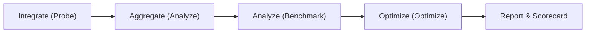

### 3. Distributed Network Topology
Strategically orchestrating standardized network across global regions, diverse cloud architectures, and multi-cloud targets, providing a unified institutional view of global network health and operational readiness.

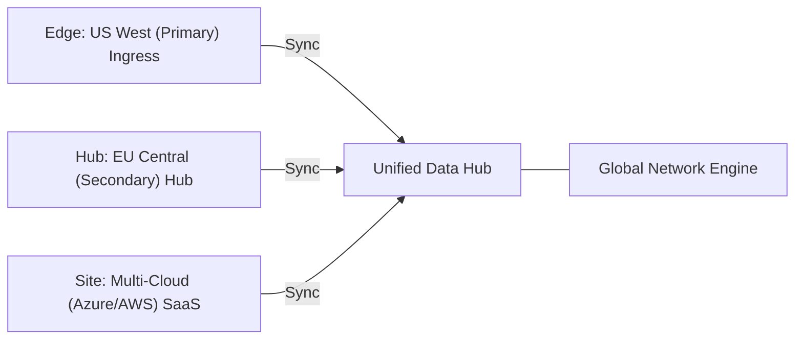

### 4. Network Hub & High-Trust Data Plane Protection Flow
Executing complex logic for securing the bridge between network owners and SRE teams, ensuring every organizational identity is verified, telemetry-level privacy is maintained, and every network access is according to institutional standards.

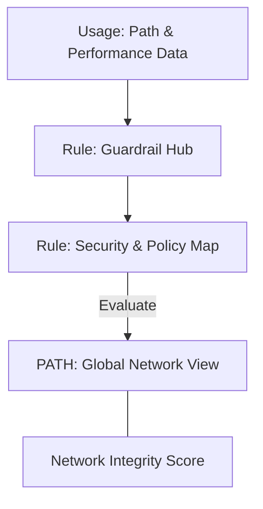

### 5. Multi-Cloud Network Federation & Governance Flow
Automatically managing unified network standards across global regions and diverse cloud tenants, ensuring institutional data residency and privacy boundaries by default.

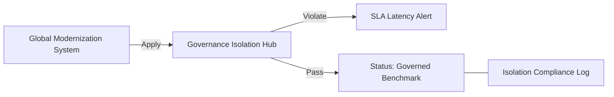

### 6. Encryption & Perimeter Protection Flow (Network Standard)
Managing the lifecycle of a network request, automatically enforcing institutional TLS 1.3 and resource encryption standards as required by security policy, ensuring zero-latency security confidence.

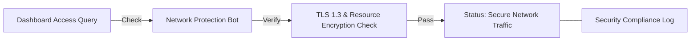

### 7. Institutional Network Maturity Scorecard
Grading organizational performance based on key indicators: Latency Consistency Index, Failover Success Index, and SLA Compliance Scores.

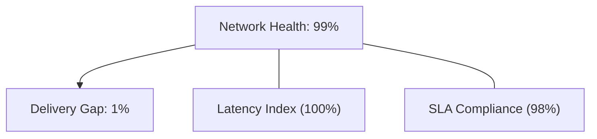

### 8. Identity & RBAC for Network Governance
Managing fine-grained access to network hubs, provisioning workers, and audit logs between Network Architects, SRE Leads, and Procurement Managers.

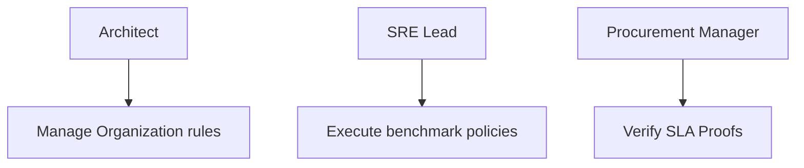

### 9. IaC Deployment: Cloud-VPN-Benchmark-as-Code Framework
Using modular Terraform to deploy and manage the versioned distribution of the network tracking hubs, probe protection workers, and forensic metadata lakes.

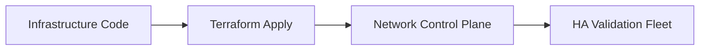

### 10. AIOps Network Drift & Risk Validation Flow
Using advanced analytics to identify sudden surges in packet loss, unauthorized route changes, suspicious configuration drifts, or unusual delivery pattern changes that could result in institutional risk or downtime.

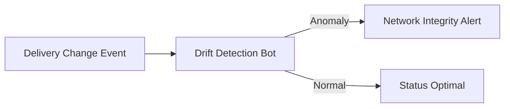

### 11. Metadata Lake for Forensic Network Audit
Storing long-term records of every network integration event (metadata), every benchmark executed, and every version history for institutional record-keeping, network auditing, and post-provisioning forensics.

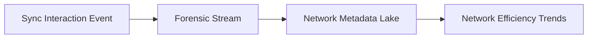

---

## 🏛️ Core Governance Pillars

1.  **Unified Foundation Coordination**: Maximizing resilience by centralizing all network measurement through a single institutional plane.
2.  **Automated Benchmark Provisioning**: Eliminating "manual probing" scenarios through proactive orchestration and pattern verification.
3.  **Sequential Performance Intelligence**: Ensuring zero-interruption operations through dependency-aware performance-driven data engineering.
4.  **Zero-Trust Identity Protection**: Automatically enforcing identity-based access, data-at-rest encryption, and policy evaluation across all network tiers.
5.  **Autonomous Operations Logic**: Guaranteeing reliability through automated industry-specific effectiveness monitoring runbooks.
6.  **Full Network Auditability**: Immutable recording of every path change and network provision for institutional forensics.

---

## 🛠️ Technical Stack & Implementation

### Network Engine & APIs
*   **Framework**: Python 3.11+ / FastAPI.
*   **Performance Engine**: Custom Python-based logic for multi-cloud probing and DORA-style network metrics.
*   **Integrations**: Native connectors for Azure VPN, AWS Site-to-Site, and BGP/IPSec stacks.
*   **Persistence**: PostgreSQL (Network Ledger) and Redis (Live Probing State).
*   **Auth Orchestrator**: Federated OIDC/SAML for least-privilege network management access.

### Governance Dashboard (UI)
*   **Framework**: React 18 / Vite.
*   **Theme**: Dark, Slate, Indigo (Modern high-fidelity productivity aesthetic).
*   **Visualization**: D3.js for delivery topologies and Recharts for SLA velocity analytics.

### Infrastructure & DevOps
*   **Runtime**: AWS EKS or Azure Kubernetes Service (AKS) for management plane.
*   **Measurement Hub**: Managed event sourcing for immutable productivity timeline reconstruction.
*   **IaC**: Modular Terraform for deploying the network landing zone and validation fleet.

---

## 🏗️ IaC Mapping (Module Structure)

| Module | Purpose | Real Services |
| :--- | :--- | :--- |
| **`infrastructure/network_hub`** | Central management plane | EKS, PostgreSQL, Redis |
| **`infrastructure/enforcers`** | Distributed probe provisioners | Azure, AWS, GCP APIs |
| **`infrastructure/probe_pipes`** | Data Ingestion Hubs | Webhooks, Lambda |
| **`infrastructure/auditing`** | Forensic modernization sinks | S3, Athena, Quicksight |

---

## 🚀 Deployment Guide

### Local Principal Environment
```bash
# Clone the Cloud VPN Benchmark repository
git clone https://github.com/devopstrio/cloud-vpn-benchmark.git
cd cloud-vpn-benchmark

# Configure environment
cp .env.example .env

# Launch the Network stack
make init

# Trigger a mock network update and automated guardrail validation simulation
make simulate-benchmark
```

Access the Management Portal at `http://localhost:3000`.

---

## 📜 License
Distributed under the MIT License. See `LICENSE` for more information.

---
<div align="center">
  <p>© 2026 Devopstrio. All rights reserved.</p>
</div>
