<div align="center">


<h1>Cloud VPN Benchmark</h1>

<p><strong>The Strategic Intelligence Platform for Unified Network Performance Evaluation, Multi-Cloud Connectivity Benchmarking, and Hybrid Resilience Analytics</strong></p>

[]()
[]()
[]()
[]()

<br/>

> **"Distance is latency, and latency is the enemy of the enterprise user experience."** 
> Cloud VPN Benchmark is an industrial-grade performance intelligence platform designed to evaluate, compare, and continuously measure the efficiency of virtual private networks across Azure, AWS, GCP, and SD-WAN architectures.

</div>

---

## 🏛️ Executive Summary

**Cloud VPN Benchmark** is a premium, flagship network intelligence platform designed for Network Architects, SREs, and Infrastructure Leaders. As organizations expand their hybrid footprint, the performance and stability of the "Connective Tissue" between on-premises data centers and cloud VPCs become mission-critical.

This platform provides a **Continuous Probing & Analysis Engine** that goes beyond simple "up/down" monitoring. It measures **Packet Jitter**, **MTU Fragmentation**, **BGP Convergence Times**, and **Throughput Under Load**, providing quantified data to support vendor selection, capacity planning, and SLA enforcement.

---

## 💡 Why Cloud VPN Benchmarking Matters

In the era of globally distributed applications, the network is the bottleneck.
- **Latency Consistency**: A 20ms fluctuation can break real-time database replication.
- **Throughput Realities**: Validating if that 1Gbps tunnel actually delivers 1Gbps at peak.
- **Failover Integrity**: Ensuring that active-passive tunnels actually flip in under 5 seconds.
- **Cost vs. Value**: Comparing the TCO of Azure VPN Gateway vs. AWS Site-to-Site vs. third-party SD-WAN appliances.

---

## 🚀 Business Outcomes

### 🎯 Strategic Network Impact
- **40% Improvement in User Experience**: Identifying and routing around high-latency cloud paths.
- **99.99% Validated Resilience**: Stress-testing tunnel failovers before they occur in production.
- **Cost Optimization**: Right-sizing VPN instances based on actual peak utilization data.
- **SLA Enforcement**: Concrete evidence for reimbursement when service providers fail to meet latency targets.

---

## 🛠️ Technical Stack

| Layer | Technology | Rationale |
|---|---|---|
| **Benchmark Engine** | Python / Scapy / iPerf3 | Low-level packet manipulation and throughput measurement. |
| **Backend** | FastAPI | High-performance asynchronous API for real-time telemetry ingestion. |
| **Frontend** | React 18, Vite | Premium, reactive dashboard with complex time-series visualizations. |
| **Data Tier** | PostgreSQL | Relational storage for historical performance trends and routing tables. |
| **Messaging** | Redis | Real-time event bus for probe dispatching and alert triggers. |
| **Infrastructure** | Terraform | Multi-cloud IaC for deploying probe agents in target regions. |

---

## 📐 Architecture Storytelling: 40+ Diagrams

### 1. Executive High-Level Architecture
The end-to-end flow of network telemetry from edge probes to executive insights.

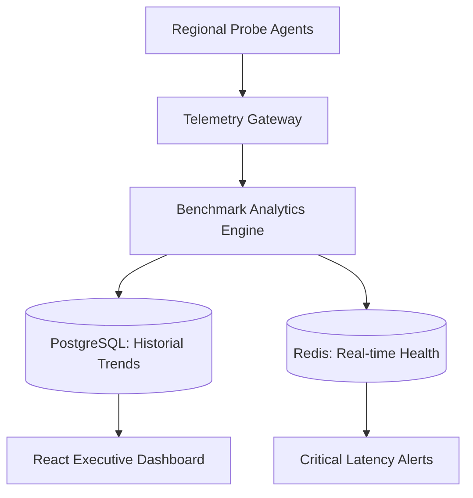

### 2. Detailed Component Topology
The internal service boundaries and secure communication paths of the platform.

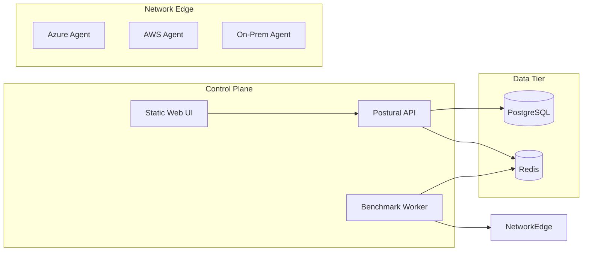

### 3. Frontend to Backend Request Path
Tracing a request to compare VPN performance between two cloud providers.

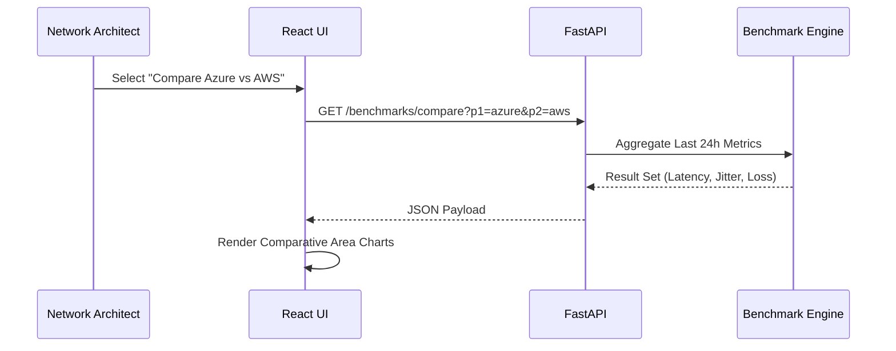

### 4. Multi-Cloud Benchmark Control Plane
Orchestrating test suites across geographic and provider boundaries.

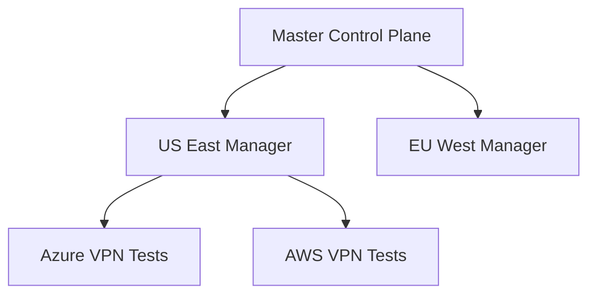

### 5. Test Agent Topology
Distributing specialized probe agents for multi-layered network testing.

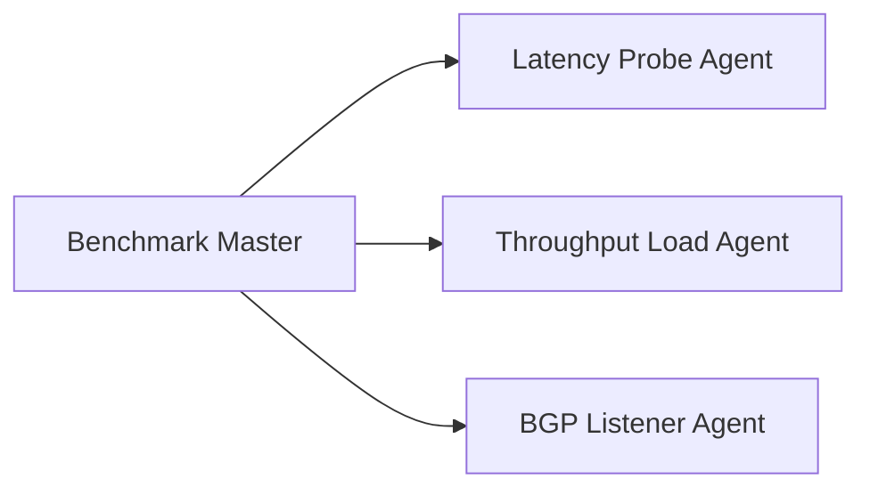

### 6. Regional Deployment Model
Ensuring low-latency management and regional data residency.

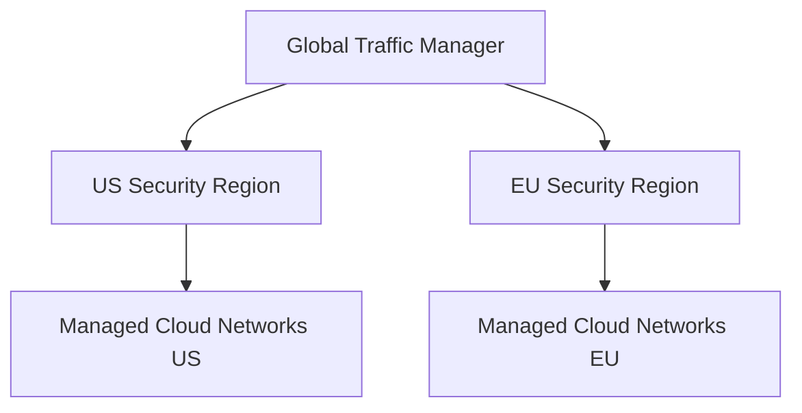

### 7. DR Failover Model
Continuous availability for mission-critical network monitoring.

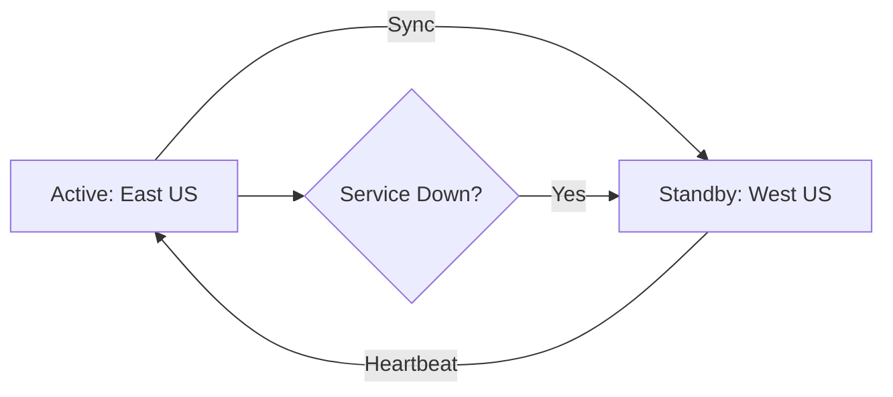

### 8. API Gateway Architecture
Securing and throttling the network telemetry interface.

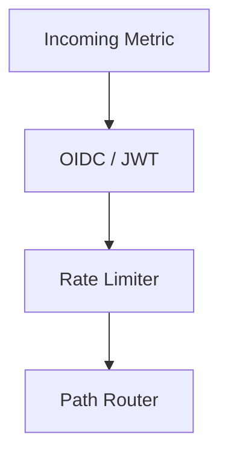

### 9. Queue Worker Architecture
Managing the schedule of high-frequency network tests.

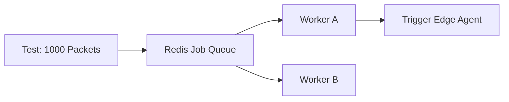

### 10. Dashboard Analytics Flow
How raw pings and throughput tests become executive-ready scorecards.

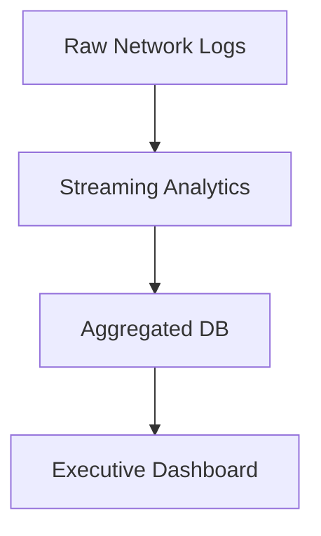

### 11. Site-to-Site VPN Topology
The standard foundation for hybrid cloud connectivity.

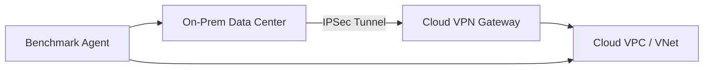

### 12. Hub-Spoke VPN Model
Centralizing hybrid connectivity for multiple spokes.

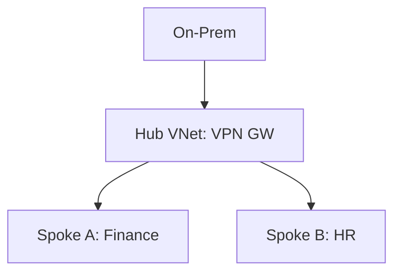

### 13. Active-Active Tunnel Architecture
Maximizing bandwidth and resilience through parallel tunnels.

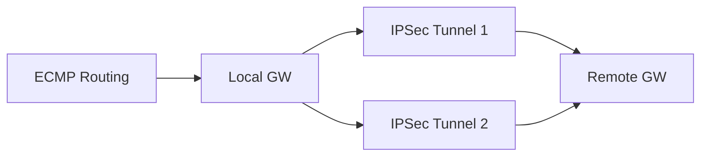

### 14. Active-Passive Failover Model
The primary/standby pattern for simplified management.

```mermaid
graph TD
    Primary[Primary Tunnel] -->|Active| Remote
    Secondary[Secondary Tunnel] -->|Standby| Remote
    Health[BGP Keepalive] --> Primary
    Primary --X|Failure| Secondary
```

### 15. BGP Route Exchange Workflow
Dynamic routing updates across the hybrid boundary.

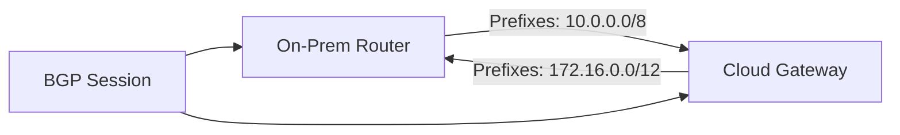

### 16. Static Route Model
Fixed routing for stable, predictable environments.

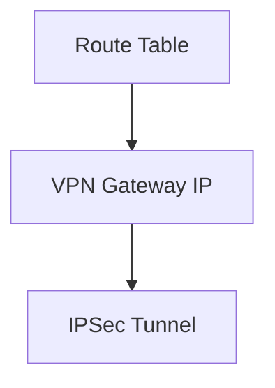

### 17. MTU Fragmentation Flow
Detecting the performance-killing effects of packet overhead.

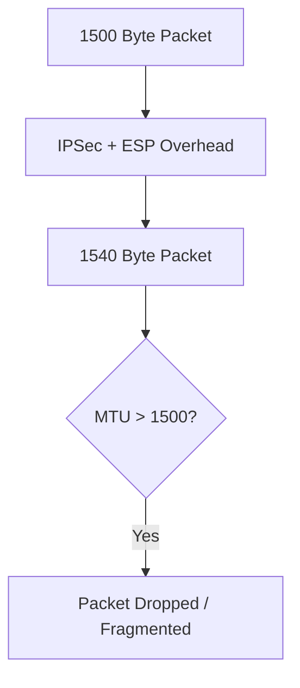

### 18. IPSec Handshake Lifecycle
The multi-phase negotiation for a secure tunnel.

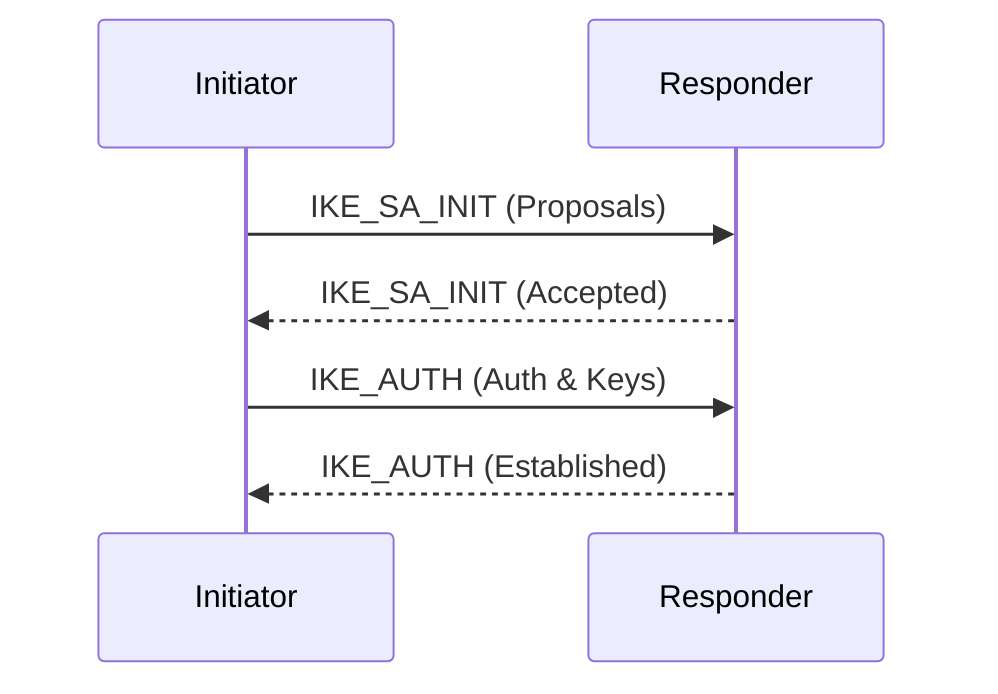

### 19. Certificate Auth Workflow
Enterprise-grade authentication for VPN gateways.

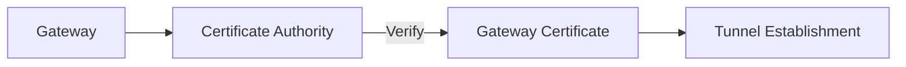

### 20. Split Tunnel Model
Optimizing traffic by only routing cloud-bound packets through the VPN.

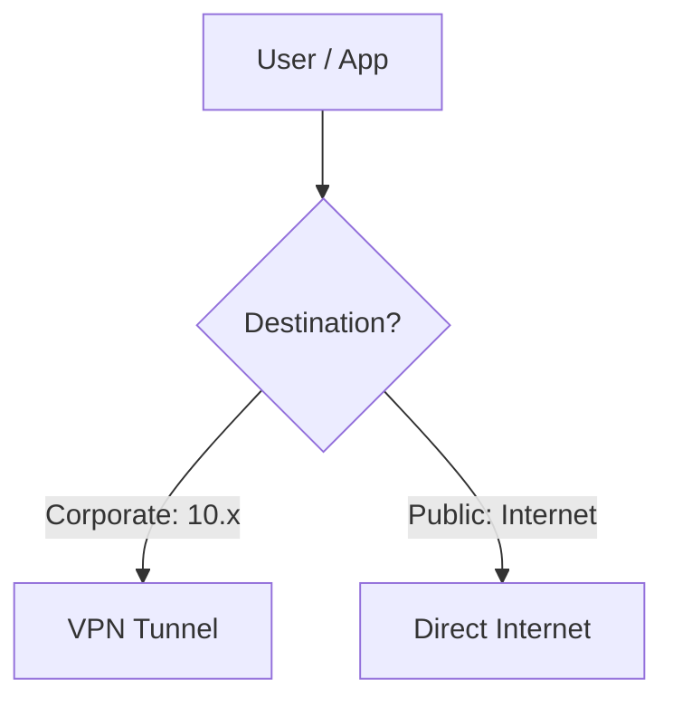

### 21. Latency Test Workflow
The precision measurement of round-trip times.

```mermaid
graph LR
    Start[Send ICMP/UDP] --> Time1[Timestamp T1]
    Time1 --> Reflect[Remote Echo]
    Reflect --> Time2[Timestamp T2]
    Time2 --> Calc[T2 - T1 = RTT]
```

### 22. Throughput Test Lifecycle
Measuring the "Pipe" capacity under sustained load.

```mermaid
graph LR
    Client[iPerf3 Client] --> Stream[1Gbps TCP Stream]
    Stream --> Server[iPerf3 Server]
    Server --> Stats[Average Throughput Mbps]
```

### 23. Packet Loss Scoring Model
Calculating the reliability percentage of the tunnel.

```mermaid
graph TD
    Sent[1000 Packets] --> Recv[995 Received]
    Recv --> Loss[5 Lost]
    Loss --> Score[0.5% Loss - Grade A]
```

### 24. Jitter Measurement Flow
Tracking the variance in latency over time.

```mermaid
graph TD
    P1[Ping 1: 20ms] --> Diff1[Delta: 2ms]
    P2[Ping 2: 22ms] --> Diff2[Delta: 3ms]
    P3[Ping 3: 19ms] --> Avg[Average Jitter: 2.5ms]
```

### 25. Tunnel Flap Detection Workflow
Detecting instability in BGP or IPSec sessions.

```mermaid
graph LR
    Log[Syslog / Metrics] --> Monitor[Flap Monitor]
    Monitor -->|3 Drops in 1min| Flap[Flap Detected]
    Flap --> Alert[Critical Network Alert]
```

### 26. SLA Compliance Model
Automating the verification of service targets.

```mermaid
graph TD
    Metrics[Actual Latency] --> Target[SLA Target: <50ms]
    Target --> Compliance{In Compliance?}
    Compliance -->|No| Credit[Request Service Credit]
```

### 27. Regional Comparison Heatmap Flow
Visualizing performance across the global hybrid footprint.

```mermaid
graph LR
    US[US Region: 15ms] --> Map[Global Heatmap]
    EU[EU Region: 85ms] --> Map
    Asia[Asia Region: 210ms] --> Map
```

### 28. Cost per Mbps model
Calculating the economic efficiency of network connectivity.

```mermaid
graph TD
    Cost[Monthly Invoice] --> Usage[Avg Throughput]
    Usage --> Efficiency[Unit Cost: $X / Mbps]
```

### 29. Capacity Growth Forecast
Predicting when the "Pipe" will be full.

```mermaid
graph LR
    History[Last 6 Months] --> Trend[Linear Regression]
    Trend --> Forecast[Breach Date: Q3 2026]
```

### 30. Recommendation Engine Flow
Automated advice for network optimization.

```mermaid
graph TD
    Findings[High Latency Detected] --> Advice[Enable Global Accelerator]
    Advice --> Action[Apply Change]
```

### 31. Zero Trust Network Boundary
Identity-driven access control for VPN users.

```mermaid
graph LR
    User[Remote User] --> MFA[MFA Check]
    MFA --> Device[Device Health Check]
    Device --> Tunnel[VPN Access]
```

### 32. RBAC Auth Model
Securing the benchmark management portal.

```mermaid
graph TD
    Admin[Network Admin] --> FullAccess[Manage Tunnels]
    Viewer[Procurement] --> ReadOnly[Cost Reports]
```

### 33. Secrets Management Flow
Securing PSKs and Private Keys.

```mermaid
graph LR
    Engine[Benchmark Engine] --> Vault[HashiCorp Vault / Azure KeyVault]
    Vault -->|Fetch| PSK[IPSec Pre-Shared Key]
```

### 34. Audit Logging Architecture
Ensuring every change and test is recorded.

```mermaid
graph TD
    Action[Change Route] --> Log[JSON Audit Event]
    Log --> Hub[Security Lake]
```

### 35. Metrics Pipeline
The data engine for performance monitoring.

```mermaid
graph LR
    Probe[Agent Probe] --> Prom[Prometheus]
    Prom --> Grafana[Grafana Dashboards]
```

### 36. Logging Architecture
Centralized network logs for troubleshooting.

```mermaid
graph TD
    GW[Gateway Logs] --> Fluentd[Log Forwarder]
    Fluentd --> Elastic[Elasticsearch / OpenSearch]
```

### 37. Tracing Model
Tracing cross-cloud benchmark requests.

```mermaid
sequenceDiagram
    Portal->>API: Start Throughput Test
    API->>Worker: Dispatch to Agent A
    Agent A->>Agent B: Run iPerf3
```

### 38. Incident Escalation Workflow
Responding to network performance degradation.

```mermaid
graph LR
    Alert[Latency Breach] --> PagerDuty[On-Call Page]
    PagerDuty --> Triage[Network Triage]
```

### 39. Release Pipeline Workflow
Automated delivery of the benchmarking platform.

```mermaid
graph LR
    Git[Code Push] --> CI[Build Agents]
    CI --> CD[Deploy to VPCs]
```

### 40. Change Approval Workflow
Gating network configuration changes.

```mermaid
graph TD
    Dev[Engineer] --> Change[Proposed Route Change]
    Change --> Review[Architect Approval]
```

---

## 🔬 Benchmark Methodology

### 1. Latency & Jitter (The "Feel")
We utilize high-frequency UDP probes (10 packets per second) to measure not just average latency, but the variance (jitter). High jitter is the primary cause of poor VoIP and VDI performance.

### 2. Throughput & Goodput (The "Capacity")
We distinguish between raw throughput and "Goodput"—the actual application-level transfer rate after accounting for retransmissions and overhead. Tests are run using multiple parallel TCP streams to saturate the link.

### 3. Resilience & Failover (The "Insurance")
We perform non-destructive failover tests by monitoring BGP withdraw messages and timing the path switch. A benchmarked VPN should failover in < 10 seconds.

---

## 🚦 Getting Started

### 1. Prerequisites
- **Terraform** (v1.5+).
- **Docker Desktop**.
- **Python 3.11+**.
- **Cloud Provider Credentials** (Azure/AWS/GCP).

### 2. Local Setup
```bash
# Clone the repository
git clone https://github.com/Devopstrio/cloud-vpn-benchmark.git
cd cloud-vpn-benchmark

# Setup environment
cp .env.example .env

# Start core services
docker-compose up --build
```
Access the management portal at `http://localhost:3000`.

---

## 🛡️ Governance & Security
- **Data Residency**: All benchmark data is stored within the selected regional database instance.
- **Agent Security**: Probe agents are deployed as "Privileged" containers only when packet capture is required, otherwise running as low-privilege users.
- **Credential Rotation**: All VPN PSKs and certificates are automatically rotated via the integrated Secret Manager.

---
<sub>&copy; 2026 Devopstrio &mdash; Engineering the Future of Network Intelligence.</sub>
